# Lifecycle machine

Generated from `apps/web/convex/lib/lifecycle.ts`. Do not edit by hand —
run `bun run lifecycle:diagram` in `apps/web`. A test fails if this file is
stale, so the picture cannot drift from the machine.

This is the picture only. [`lifecycle-machine.md`](./lifecycle-machine.md)
explains how the machine works and what to know before changing it — read
that first if you are about to add a state, an event or an effect.

An edge labelled `dynamic` targets a state chosen at runtime from the
event and the facts (RE_ADMIT returns to `formerOf` — the tier a person
held before they left, so a re-admitted person returns to it; SET_ROLE,
IMPORT, GRANT_CORE, REVOKE_CORE and EXTEND_WINDOW leaving guest.expired
all take their target tier from the event or resolve to `.active` or
`.onboarding` depending on whether the person's compliance and steps are
complete).

```mermaid
stateDiagram-v2
    state "prospect.unverified" as prospect_unverified
    state "prospect.verified" as prospect_verified
    state "prospect.queued" as prospect_queued
    state "prospect.denied" as prospect_denied
    state "guest.onboarding" as guest_onboarding
    state "guest.active" as guest_active
    state "guest.expired" as guest_expired
    state "member.onboarding" as member_onboarding
    state "member.active" as member_active
    state "core.onboarding" as core_onboarding
    state "core.active" as core_active
    state "board.active" as board_active
    state "admin.active" as admin_active
    state "staff.active" as staff_active
    state "former.active" as former_active
    state "visitor.unverified" as visitor_unverified
    state "visitor.verified" as visitor_verified
    prospect_unverified --> prospect_verified: VERIFY_EMAIL
    prospect_unverified --> prospect_unverified: REAPPLY
    prospect_unverified --> dynamic: IMPORT
    prospect_unverified --> dynamic: SET_ROLE
    prospect_verified --> prospect_queued: SET_SCORE
    prospect_verified --> dynamic: APPROVE_GUEST
    prospect_verified --> dynamic: APPROVE_MEMBER
    prospect_verified --> prospect_denied: DENY
    prospect_verified --> dynamic: SET_ROLE
    prospect_queued --> prospect_queued: SET_SCORE
    prospect_queued --> dynamic: APPROVE_GUEST
    prospect_queued --> dynamic: APPROVE_MEMBER
    prospect_queued --> prospect_denied: DENY
    prospect_queued --> dynamic: SET_ROLE
    prospect_denied --> prospect_unverified: REAPPLY
    prospect_denied --> prospect_queued: UNDENY
    prospect_denied --> dynamic: SET_ROLE
    guest_onboarding --> guest_active: ONBOARDING_PROGRESSED
    guest_onboarding --> former_active: KICK_OUT
    guest_onboarding --> former_active: MARK_LEFT
    guest_onboarding --> dynamic: SET_ROLE
    guest_onboarding --> member_onboarding: PROMOTE_TO_MEMBER
    guest_onboarding --> guest_onboarding: EXTEND_WINDOW
    guest_onboarding --> guest_expired: WINDOW_EXPIRED
    guest_active --> guest_active: ONBOARDING_PROGRESSED
    guest_active --> former_active: KICK_OUT
    guest_active --> former_active: MARK_LEFT
    guest_active --> dynamic: SET_ROLE
    guest_active --> member_onboarding: PROMOTE_TO_MEMBER
    guest_active --> guest_active: EXTEND_WINDOW
    guest_active --> guest_expired: WINDOW_EXPIRED
    guest_expired --> former_active: KICK_OUT
    guest_expired --> former_active: MARK_LEFT
    guest_expired --> dynamic: SET_ROLE
    guest_expired --> member_onboarding: PROMOTE_TO_MEMBER
    guest_expired --> dynamic: EXTEND_WINDOW
    guest_expired --> prospect_unverified: REAPPLY
    member_onboarding --> member_active: ONBOARDING_PROGRESSED
    member_onboarding --> former_active: KICK_OUT
    member_onboarding --> former_active: MARK_LEFT
    member_onboarding --> dynamic: SET_ROLE
    member_active --> member_active: ONBOARDING_PROGRESSED
    member_active --> former_active: KICK_OUT
    member_active --> former_active: MARK_LEFT
    member_active --> dynamic: SET_ROLE
    member_active --> dynamic: GRANT_CORE
    member_active --> board_active: PROMOTE_TO_BOARD
    core_onboarding --> core_active: ONBOARDING_PROGRESSED
    core_onboarding --> former_active: KICK_OUT
    core_onboarding --> former_active: MARK_LEFT
    core_onboarding --> dynamic: SET_ROLE
    core_active --> core_active: ONBOARDING_PROGRESSED
    core_active --> former_active: KICK_OUT
    core_active --> former_active: MARK_LEFT
    core_active --> dynamic: SET_ROLE
    core_active --> dynamic: REVOKE_CORE
    core_active --> board_active: PROMOTE_TO_BOARD
    board_active --> former_active: KICK_OUT
    board_active --> former_active: MARK_LEFT
    board_active --> dynamic: SET_ROLE
    admin_active --> former_active: KICK_OUT
    admin_active --> former_active: MARK_LEFT
    admin_active --> dynamic: SET_ROLE
    staff_active --> former_active: KICK_OUT
    staff_active --> former_active: MARK_LEFT
    staff_active --> dynamic: SET_ROLE
    former_active --> dynamic: RE_ADMIT
    former_active --> prospect_unverified: REAPPLY
    former_active --> dynamic: SET_ROLE
    visitor_unverified --> prospect_unverified: REAPPLY
    visitor_verified --> prospect_unverified: REAPPLY
```

